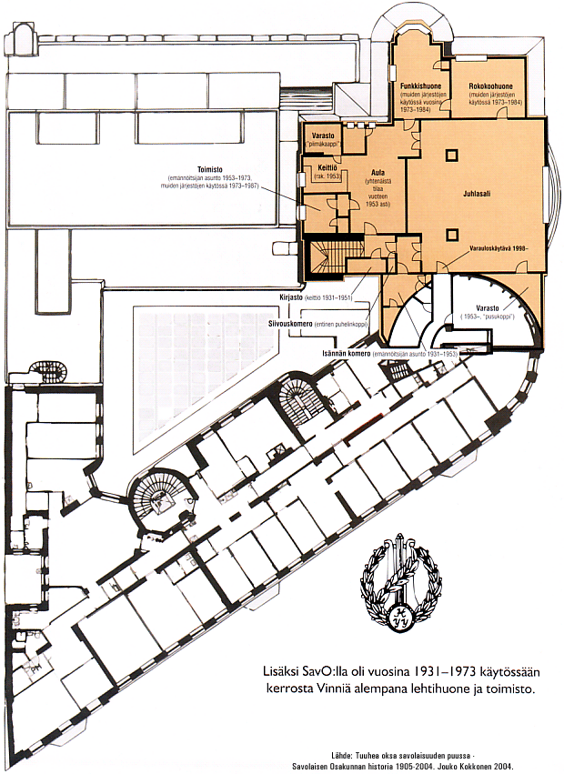

## Tilat

TODO: update content and decide how images should be rendered.

Osakuntatila sijaitsee Uuden ylioppilastalon ylimmässä kerroksessa (Mannerheimintie 5 A, ylin krs.) mistä johtuukin nimi "Vinni".

Kesästä 2010 alkaen Savolainen osakunta on jakanut tilat yhdessä Varsinaissuomalaisen osakunnan kanssa.

Vinnillä majailevat myös Osakuntien Yhteisvaltuuskunta ry, HYYn Osakuntalainen Unioni ry ja Opiskelijakansantanssijat ry.

